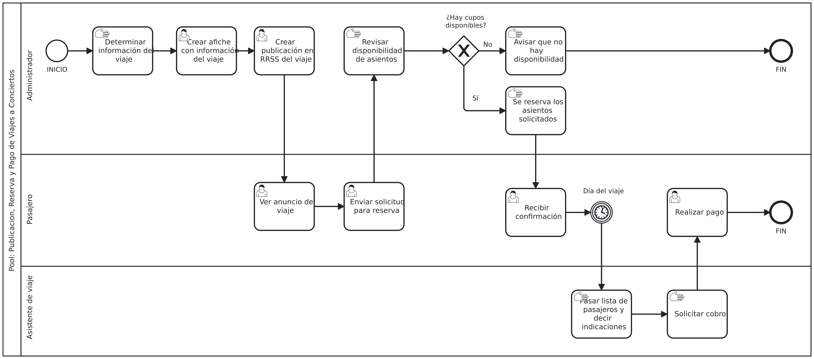

# Proceso de negocio — AS-IS
 
## Macro-proceso y proceso específico
Gestión de Ventas y Servicios de Transporte → Creación de viajes, reserva manual de asientos, pago y control de pasajeros.
 
## Objetivo de negocio del proceso
Gestionar la inscripción de los clientes a los viajes de conciertos, informando las condiciones del traslado, registrando los cupos solicitados y verificando el pago el día del evento para llenar la capacidad del furgón.

## Participantes y sus objetivos
| Participante | Objetivo en el proceso |
|---------------|------------------------|
| Cliente / Pasajero | Consultar por viajes, reservar asientos de manera sencilla sin abono previo y asistir al evento. |
| Administrador | Definir precios basados en los costos, llevar registros de los asientos de las reservas en una libreta. |
| Asistente de viaje | Revisar que los pasajeros en la lista esten presentes y realizar cobros respectivos. |
 
## Diagrama AS-IS

 
Archivo fuente: [`./diagramas/as-is.bpmn`](./diagramas/as-is.bpmn)
 
 
## Problemas identificados
- Perdida de tiempo al tener que responder mensajes cuando no hay cupos disponibles.
- Carencia de un registro automatizado, lo que los obliga a depender de libretas manuales para llevar el control de los cupos disponibles de cada concierto.
- Riesgo de inasistencia, dado que no exigen abono previo, dejando el cobro y la verificación de pagos para el mismo día del viaje.
