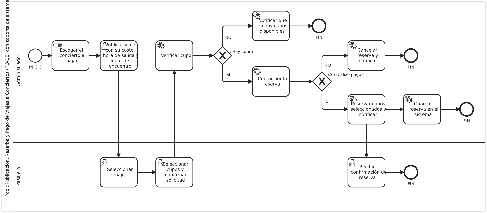

# Análisis de rediseño y propuesta TO-BE
 
## Mejoras identificadas por participante
| Participante | Objetivo | Problema | Mejora deseada |
|----------------|----------|----------|-----------------|
| Cliente/Pasajero | Reservar un asiento rápido y asegurar su viaje al concierto. | Debe esperar respuesta manual para saber si queda cupo y pagar presencial el día del viaje. | Poder ver los cupos, reservar de forma autónoma y usar pago rápido en línea. |
| Administrador | Crear viajes, llenarlos sin sobrepasar los cupos limitados y asegurar el pago. | Perdidad de tiempo respondiendo mensajes cuando ta no hay cupos y anota en libretas con riesgo de error o inasistencia. | Sistema para crear el viaje (cartelera), que maneje los cupos de forma automatizada y genere planillas de pasajeros, ademas de bloquear reservas si se llena la capacidad. |
 
## Iniciativas de rediseño
### Iniciativa 1
- Actividad(es) del AS-IS que afecta: Revisa la libreta física, responder al cliente que ya está lleno y anotar nombres en la libreta.
- Heurística aplicada: Autoservicio y Automatización de tareas.
- Objetivo o mejora que resuelve: Evitar que el administrador deba gestionar manualmente la disponibilidad y anotar pasajeros.
- Efecto esperado (tiempo/costo/calidad/flexibilidad): Reducción del tiempo de atención al cliente. Mejora en la calidad de la información al no depender de una libreta física.

### Iniciativa 2
Actividad(es) del AS-IS que afecta: Realizar el pago presencial, Verificar transferencia o entregar voucher.
- Heurística aplicada: Integración (pasarela de pagos).
- Objetivo o mejora que resuelve: Asegurar el pago por adelantado mediante opciones en línea (débito, crédito, transferencia).
- Efecto esperado (tiempo/costo/calidad/flexibilidad): Disminución del riesgo económico por cancelaciones sin abono y reducción de cuellos de botella al abordar el furgón.
 
## Diagrama TO-BE

 
Archivo fuente: [`./diagramas/to-be.bpmn`](./diagramas/to-be.bpmn)
 
Nota: distingan tareas de usuario, de servicio y manuales con el marcador correspondiente.
 
## Actividades que cambian del AS-IS al TO-BE
| Actividad en el AS-IS | Actividad en el TO-BE | Qué cambia |
|-----------------------|------------------------|------------|
| Crear afiche publicitario y publicarlo | Crear viaje en el sistema | El administrador registra el viaje en la plataforma y el sistema genera la cartelera estandarizada automáticamente. |
| Cliente envía mensaje preguntando por el viaje | Explorar cartelera y seleccionar viaje | El cliente consulta los viajes disponibles directamente en la aplicación, sin depender de mensajes con el administrador. |
| Revisar la libreta física para verificar que los cupos | Validar disponibilidad de cupos | El sistema consulta automáticamente los cupos disponibles y evita que se supere la capacidad máxima de 17 pasajeros. |
| Responder al cliente que ya está lleno | Notificar indisponibilidad | El sistema informa automáticamente cuando no existen cupos disponibles y bloquea nuevas reservas para el viaje. |
| Registrar nombres en la libreta | Registrar reserva y pasajero | Los datos del pasajero y su reserva quedan registrados automáticamente en el sistema, sin necesidad de anotarlos manualmente. |
| Realizar el pago presencial (efectivo/transferencia) | Procesar pago en línea | El pasajero realiza el pago mediante los medios disponibles en la plataforma al momento de efectuar la reserva. |
| Pasar lista en el furgón utilizando la libreta | Visualizar lista digital de pasajeros | El administrador consulta una lista digital generada automáticamente con los pasajeros que poseen una reserva. |
